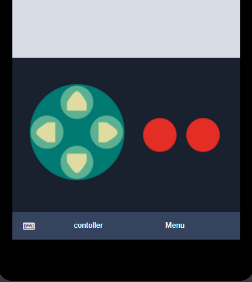

# LINE Simulator for BOT developer
日本語は[こちら](./README_ja.md)

Are you getting tired using physical device for debug your LINE bot? Yes I am! This project contains simulator to boost your developer productivity.

# Install from npm
If you just want to use it, install and run from npm.
```
npm install -g line-simulator
line-simulator
```
or for macOS, 
```
sudo npm install -g line-simulator
sudo line-simulator
```
It will open a browser and start the service on port 8080. I recommend using Chrome as browser.
When you stop it, Ctrl+C from the terminal.

# Get it from GitHub
## Prerequisits
- LINE developer account
- node.js
- And of course your LINE bot app :)
- **This app is only tested in Chrome**

## Simulator setup
Use following commands to clone and install module. Then for Windows run npm start.
```
git clone https://github.com/kenakamu/LINESimulator
npm install
npm start
```

for MacOS, replace the last command as:
```
npm startMac
```

for Linux, replace the last command as: 
```
npm startLinux
```

If you prefer using different browser, then open it and manully connect to http://localhost:8080

# How this works
This app works as LINE client simnulator, as well as LINE Platform simulator. All the request from your bot application shall come to this simulator, and it will redirect to LINE platform if necessary, otherwise it just returns the message to simulator UI.

It has two main features.
- [Debugging Experience](#debugging-experience): LINE simulator to improve debugging experience.
- [LINE Bot POC](#line-bot-poc): Quickly craft mock via UI

# Debugging Experience

## How to specify the simulator URL for bot application
1. Follow the setup to run the simulator. By default it uses port 8080. If you dont' like it, change it in the source code.
1. In your bot app, specify http://localhost:8080 as your LINE URL. This varies depending on which SDK you are using.

**C#**: Pass the URL for LineMessagingClient constructor.
```csharp
var lineMessagingClient = new LineMessagingClient(accessToken, "http://localhost:8080");
``` 
**Golang**: Pass the URL for linebot.New
```go
bot, err := linebot.New(
		channelSecret,
		channelToken,
		"http://localhost:8080"
	)
```
**python**: Pass the URL for linebot.LineBotApi constructor. 
```python
line_bot_api = LineBotApi(channel_access_token, "http://localhost:8080")
```
**Node.js**: for node.js it is slightly different. Specify the URL with /bot at the end for process.env.API_BASE_URL. You can do so in config or write it in the code, but you need to do so before you loda @line/bot-sdk module.
```javascript
process.env.API_BASE_URL = "http://localhost:8080/bot";
const line = require('@line/bot-sdk');
```

## How to use the simulator.
1. Open Chrome and connect to http://localhost:8080
1. You will see the connection page. Enter your Bot API URL, user id, channel secret and token, then click "connect". You can get UserId, ChannelSecret and ChannelToke from [LINE Developer Portal](https://developers.line.me/console/) <br/>
1. In the chat bar, enter any text and hit "Enter" or click send icon.<br/>
1. Depending on your implementaion, you can see reply.<br/>

## Update settings
1. Simply click gear icon.
1. Change settings and click connect.

You can also specify any LINE user so this is useful to test with other user.

## Send non-text
1. Click "Right arrow" icon either in chatbar or in menu.<br/>
1. Use the more menu area to send any non-text data. You can send image, sticker, location or system messages. <br/>

## See the JSON object
1. Select any sent or replied area.
1. You see JSON object.<br/>
1. Click close icon to close it.

# LINE BOT POC
By using the simulator POC feature, you can quickly craft LINE Bot chat mock via UI only so that you don't have to write code to just show how it works to customers.

## Start POC
1. Click POC Mode button at login. If you already connected, you can click settings icon (gear) anytime to switch the mode.
<br/>
1. You see bot reply box in POC mode.
<br/>

## Send message as user
1. To send simple text message, use chatbox in the simulator to send the text.
<br/>
1. To send more complex message, use more menu button to send it.
<br/>
<br/>

## Send message as bot
1. Use bot reply box. Select the type you want to send. 
1. For carousel or image carousel template, click "add new column" button first to start crafting the message.
<br/>
1. You can add or delete the columns as you want.
1. For template, you see the preview in the box and it update the value as you type.
<br/>

## Delete or move the chat item
1. If you want to delete or move the chat item, select the item in the simulator.
<br/>
1. Click trash icon to delete, or arrows to move the chat item as you wish.

## Save the chat
1. In case you want to save the chat, click download icon on the menu.
<br/>
1. It will be downloaded as json file. You can modify the json file if you want, and it adhere to LINE Messaging API format.

## Load the chat
1. To load the saved chat, click upload icon on the menu.
<br/>
1. Select the json file you saved before.

# Common Features
At the moment, the simulator can:
- Send text, image, location, sticker, system events.
- Display text
- Display image/video
- Display buttons, confirm, carousel templates
- Handle actions from templates

## Change the simulator size
At the moment, you need to manually change the size. Just simply modify the value of css variables in public/css/site.css.

## Zoom
1. Click zoomin or zoomout in menu.<br/>
1. Confirm the only simulator zoomin/out.

When you need to zoom entire page, simply use browser zoom feature.

## Keyboard
You can simulate how keyboard hides the chat window.
1. Click keyboard icon either in chatbar or in menu.<br/>
1. You see keyboard is appearing in the chat. You cannot type via keyboard as this is just an image.<br/>

## Rich Menu
You can simulate how Rich Menu works. The default rich menu set in developer console cannot be simulated.
1. Click rich menu icon in menu.<br/>
1. You see rich menu if the user has one, otherwise see the alert.<br/>
1. Click the menu again to hide it.

## Feature to be added
- Datetime Picker
- URL actions
- Simulator choice such as iPhone X/iPhone 8/Xperia XZ1 etc.
