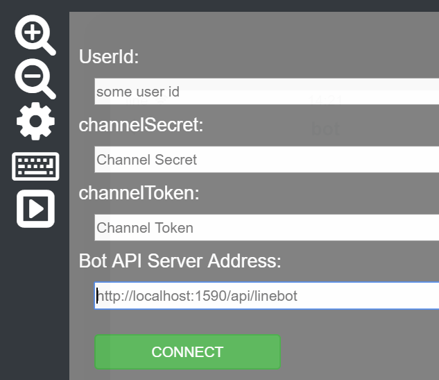
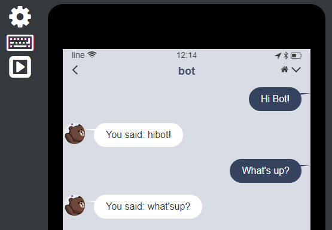
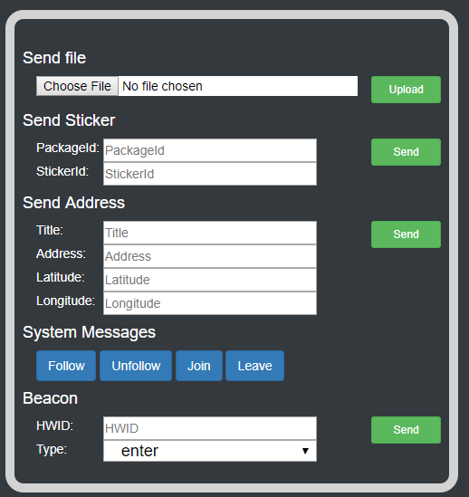
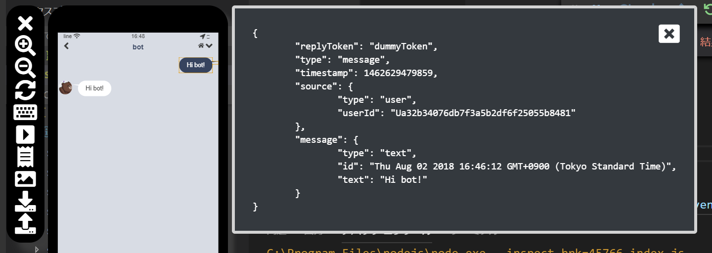
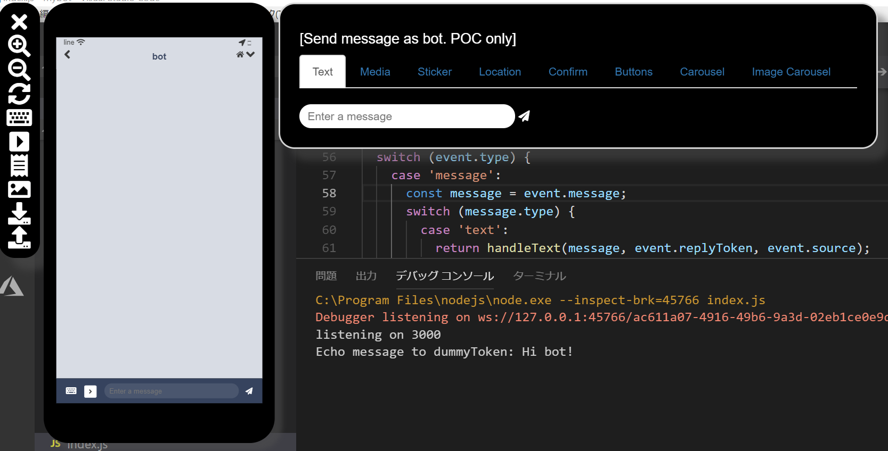
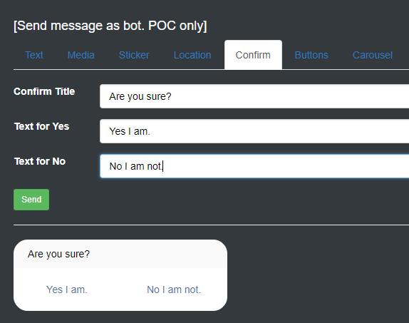
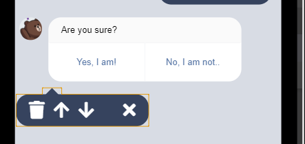
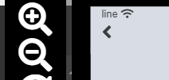
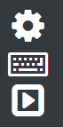
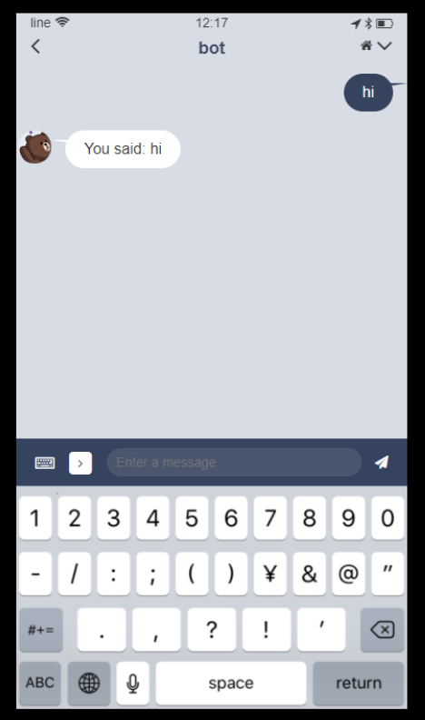

# BOT 開発者向け LINE シミュレーター
LINE Bot 開発は楽しいけど、動作確認に実機を使うのは面倒だという私のような開発者の方向けに、シミュレーターを提供します。これで開発、テスト、リリースまでの生産性が向上することを願って。

## NPM からインストール
すぐに使いたい場合は、NPM からインストールして使えます。
```
npm install -g line-simulator
line-simulator
```
サービスがポート 8080 で起動し、ブラウザが自動的に開きますが、Chrome を使うことを推奨します。止める際はターミナルから Ctrl+C で終了してください。

## 前提条件
- LINE 開発者アカウント
- node.js
- 開発中の LINE Bot アプリ
- **Chrome でしかテストしてません。**

## シミュレーターのセットアップ
以下のコマンドでレポジトリのクローンおよび必要のモジュールのインストールをします。また Windows の場合は最後に npm start を実行します。
```
git clone https://github.com/kenakamu/LINESimulator
npm install
npm start
```

MacOS の場合は最後の行を以下に変えてください。
```
npm startMac
```

Linux の場合は最後の行を以下に変えてください。
```
npm startLinux
```
意図したブラウザが起動しない場合は手動で http://localhost:8080 に接続してください。

# 動作原理
このアプリは LINE クライアントのシミュレーターとして機能すると同時に、LINE プラットフォームのシミュレーターとしても機能します。Bot アプリからの送信はすべてのこのシミュレーターに送信され、必要に応じて LINE プラットフォームに転送されます。そして結果がシミュレーターの画面に表示されます。

シミュレーターは大きく分けて以下の機能があります。
- [デバッグ用シミュレーター](#デバッグ用シミュレーター): デバッグをローカルで行うためのシミュレーター
- [LINE Bot POC](#line-bot-poc): UI のみでボットの会話の流れを簡単にモック

# デバッグ用シミュレーター

## Bot アプリにシミュレーターの URL を設定
1. 上記手順に沿ってセットします。既定でポート 8080 を使いますが変えたい場合は自由にコードを変えてください。
1. Bot アプリで http://localhost:8080 を LINE URL として指定します。使っている言語によってやり方が多少異なります。

**C#**: URL を LineMessagingClient コンストラクタに渡します。
```csharp
var lineMessagingClient = new LineMessagingClient(accessToken, "http://localhost:8080");
``` 
**Golang**: URL を linebot.New に渡します。
```go
bot, err := linebot.New(
		channelSecret,
		channelToken,
		"http://localhost:8080"
	)
```
**python**: URL を linebot.LineBotApi コンストラクタに渡します。 
```python
line_bot_api = LineBotApi(channel_access_token, "http://localhost:8080")
```
**Node.js**: node.js の場合は URL の最後に /bot を付けて、 process.env.API_BASE_URL に渡します。ソースコードに埋め込む場合は、@line/bot-sdk を読み込む前に設定してください。
```javascript
process.env.API_BASE_URL = "http://localhost:8080/bot";
const line = require('@line/bot-sdk');
```

## 使い方
1. Chrome を開いて http://localhost:8080 に接続。
1. 接続ページが出るので、必要な値を入力して、"connect" をクリック。UserId, ChannelSecret, ChannelToken は [LINE 開発者ポータル](https://developers.line.me/console/) から取得可能。<br/>
1. チャットバーにメッセージを入れて、Enter キー押下または送信アイコンをクリック。<br/>
1. 返信を確認。<br/>

## 設定の更新
1. 設定アイコンをクリック。
1. 必要な変更を行って、connect をクリック。

自分以外の LINE ユーザーID も指定できるので、他ユーザーの挙動も確認できます。

## テキスト以外の送信
1. チャットバーかメニューの右矢印アイコンをクリック。 <br/>
1. 表示されるメニューで必要なものを送信。画像やステッカーのほか、場所やフォローなどシステムメッセージも送信可能。<br/>

## JSON の表示
1. 画面上のアイテムをクリック。
1. 対応する JSON が確認可能<br/>
1. 閉じるアイコンで閉じる。

# LINE BOT POC
POC 機能を使うことで UI のみで Bot の会話の流れを簡単にモックできます。これでデモで画面を出すだけのために開発する必要がなくなります。

## POC の開始
1. POC Mode ボタンを初期画面でクリック。既にデバッグ用で接続した場合は、設定のギアアイコンをクリックして設定画面を出す。
<br/>
1. POC モードになると Bot の返信用画面が表示。
<br/>

## ユーザーとしてメッセージを送信
1. テキストを送る場合はシミュレーターのチャットバーより送信。
<br/>
1. 画像やステッカーなどを送る場合は、チャットバーかメニューの右矢印アイコンをクリック。表示された画面から送信。
<br/>
<br/>

## Bot としてメッセージを返信
1. シミュレーター右にある Bot 用の返信画面より送りたいタイプを選択して送信。 
1. カルーセルや画像カルーセルは、まず "add new column" ボタンをクリックしてカラムを追加してから設定。
<br/>
1. さらに追加や既存のカラムを選択して削除が可能。
1. テンプレート系のメッセージはプレビューが下部に表示される。
<br/>

## チャットアイテムの削除と移動
1. 間違えたり変更したい場合に、画面に表示されたチャットアイテムの削除や移動が可能。変更したいチャットアイテムを選択。
<br/>
1. 削除する場合はゴミ箱アイコン、移動は矢印で行う。

## チャットの保存
1. 作成した画面を保存したい場合ダウンロードアイコンをクリック。
<br/>
1. json 形式のファイルとして保存。中身を直接編集も可能。フォーマットは LINE Messaging API に準拠。

## チャットのロード
1. 保存したチャットをロードする場合はアップロードアイコンをクリック。
<br/>
1. 保存した json ファイルを選択。

# 共通機能
現時点でシミュレーターは以下の機能を提供:
- テキスト、画像、動画、場所、ステッカー、システムイベントの送信
- テキスト返信の表示
- 画像/動画返信の表示
- ボタン、確認、カルーセルテンプレート返信の表示
- テンプレートのアクションをハンドル (URI アクション以外)

## シミュレーターサイズの変更
現時点では手動で CSS の変更が必要。public/css/site.css の上部にある変数を変更して調整してください。

## 拡大/縮小
1. ズームアイコンをクリック。<br/>
1. シミュレーターのみ拡大、縮小されることを確認。

ページ全体の倍率変更はブラウザの機能で実行してください。

## キーボード
キーボードが出ると画面に見え方が変わります。以下の手順でキーボードを出せます。ただし入力はできません。
1. チャットバーかメニューのキーボードアイコンをクリック。<br/>
1. キーボードが出ることを確認。<br/>

## 追加したい機能
- 日付ピッカー
- URI アクション
- リッチメニュー
- iPhone X/iPhone 8/Xperia XZ1 等のサイズの簡単な選択
